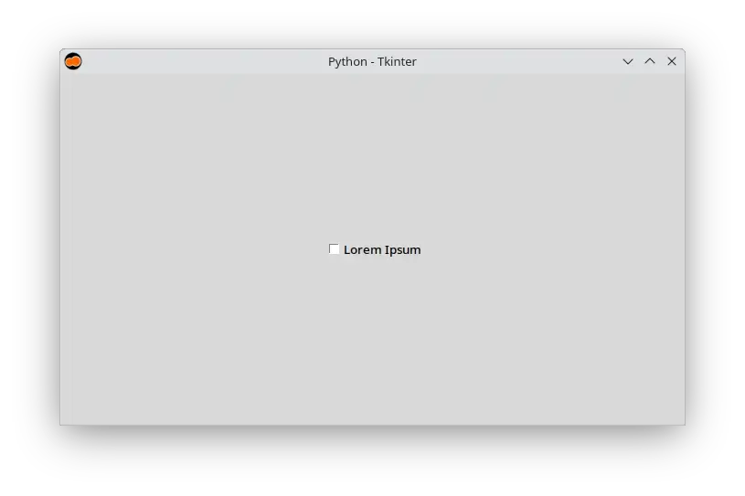
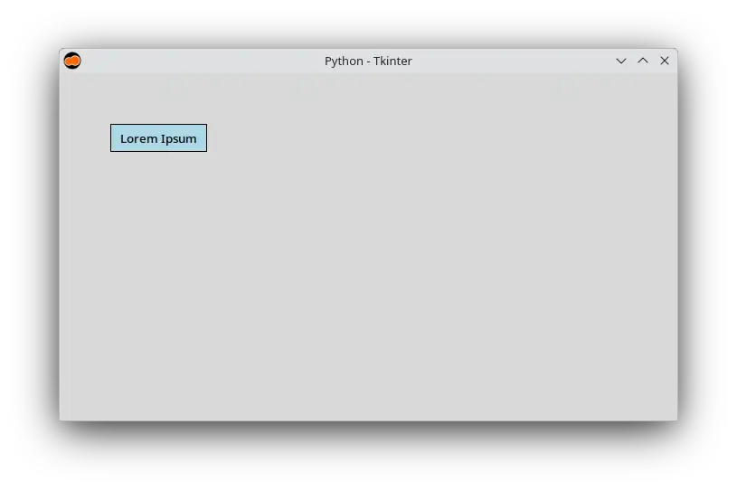
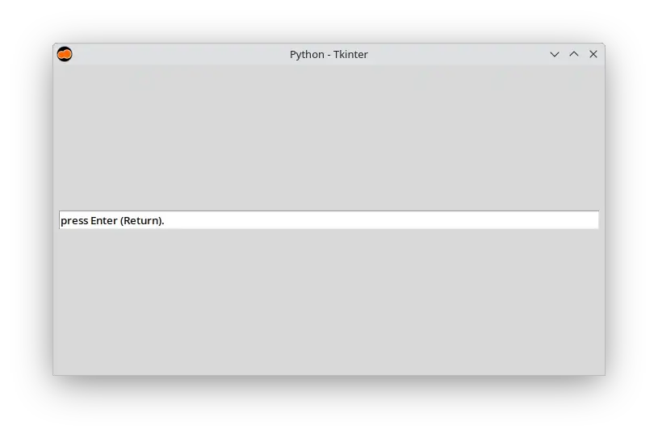
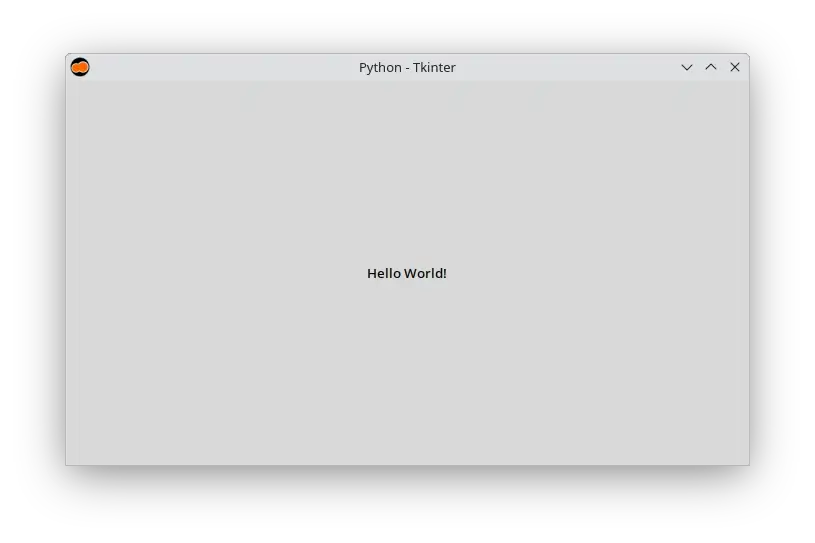
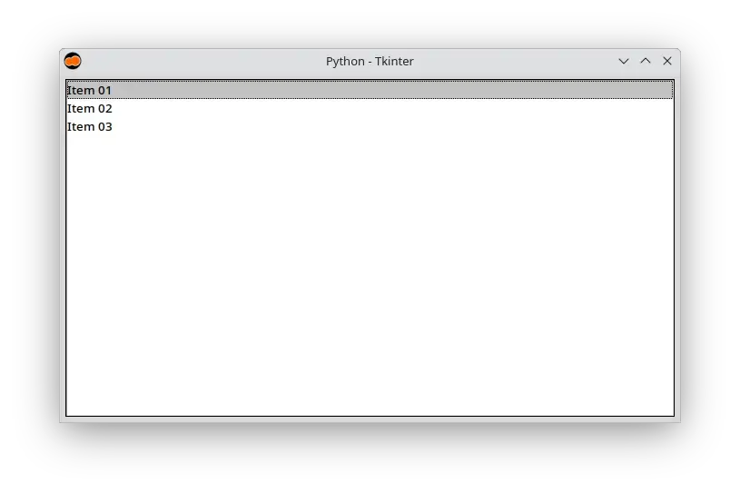
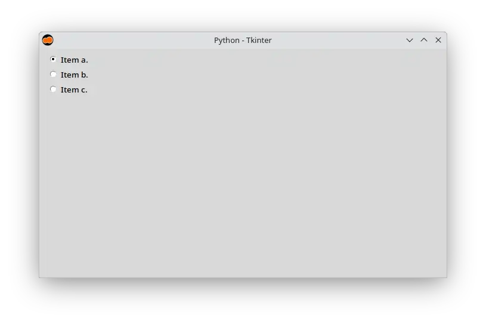
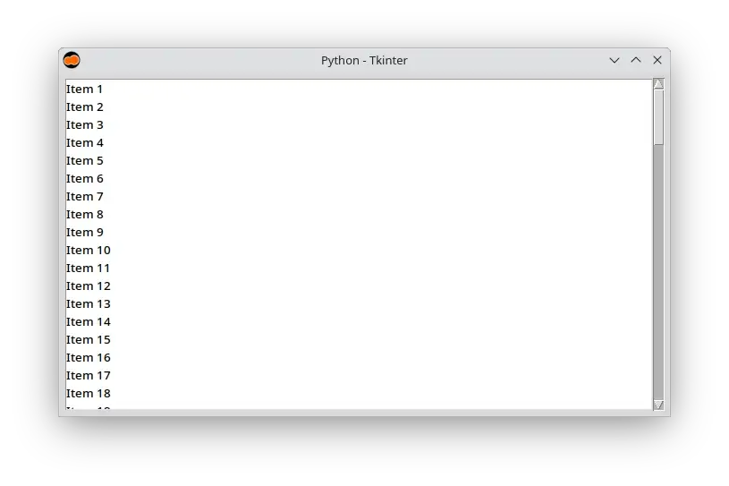
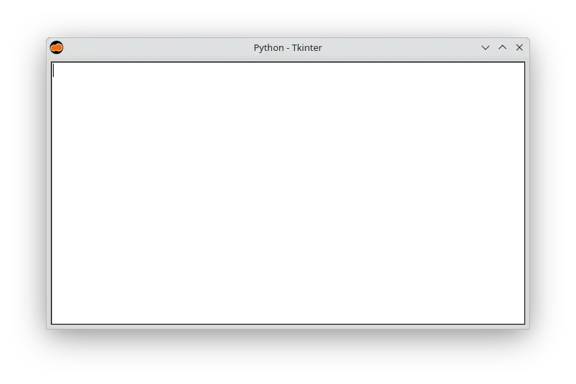

# Criando interfaces gráficas com Python e Tkinter

- [🇺🇸](./README.md)
- [🇧🇷](./README-pt_BR.md)

## ✨ Sobre o Projeto

Este repositório é o seu ponto de partida para aprender a criar interfaces gráficas modernas com a linguagem de programação Python e Tkinter. Com tutoriais, dicas e exemplos práticos, você vai aprender na prática e evoluir seus projetos.

Se este conteúdo te ajuda, considere fazer uma doação. Seu apoio é essencial para manter o projeto ativo e crescendo! 💙

## 🛠 Tecnologias Utilizadas

## 👨‍💻 Autor

Feito com 💙 por Renato Cruz. Tem dúvidas ou sugestões? Entre em contato comigo!

Enquanto estudo ou programo, estou ouvindo essa playlist 😎🎵:

## 💝 Apoie este Projeto

Sua contribuição mantém este projeto vivo e me ajuda a continuar compartilhando conhecimento.

### GitHub Sponsors

[https://github.com/sponsors/natorsc/](https://github.com/sponsors/natorsc/)

### Chave Pix (Brasil)

`b1839493-2afe-484d-9272-82a3e402b36f`

---

## 💡 Extra

### CustomTkinter

- [CustomTkinter](https://github.com/TomSchimansky/CustomTkinter).
- [CustomTkinter site](https://customtkinter.tomschimansky.com/).

---

## Widgets

### Button

Code:

- [Python](src/button/main.py).

---

### Canvas

Code:

- [Python](src/canvas/main.py).

---

### Checkbutton

Code:

- [Python](src/check-button/main.py).

---

### DND

Code:

- [Python](src/dnd/main.py).

---

### Entry

Code:

- [Python](src/entry/main.py).

---

### Label

Code:

- [Python](src/label/main.py).

---

### Listbox

Code:

- [Python](src/listbox/main.py).

---

### MainWindow

Code:

- [Python](src/main-window/main.py).

---

### Radiobutton

Code:

- [Python](src/radio-button/main.py).

---

### Scrollbar

Code:

- [Python](src/scrollbar/main.py).

---

### Text

Code:

- [Python](src/text/main.py).

---
