# Build beautiful GUIs with Python and Tkinter

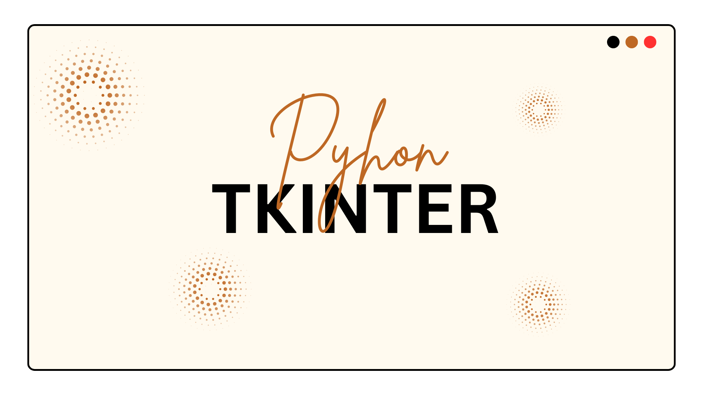

- [🇺🇸](./README.md)
- [🇧🇷](./README-pt_BR.md)

## ✨ About this project

This repository is your complete guide to building sleek, modern graphical user interfaces with Python and Tkinter. Whether you're a beginner or an experienced developer, you'll find practical tutorials, tips, and real code examples to level up your projects.

If this content has helped you, please consider making a donation. Your support makes a real difference and helps the project grow! 💙

## 🛠 Technologies used

## 👨‍💻 Author

Crafted with 💙 by Renato Cruz. Got questions or feedback? Reach out anytime!

What I'm listening to while I code or study 😎🎵:

## 💝 Support This Project

Your donation keeps this project alive and helps me continue creating and sharing useful content.

### GitHub Sponsors

[https://github.com/sponsors/natorsc/](https://github.com/sponsors/natorsc/)

### Pix (Brazil)

`b1839493-2afe-484d-9272-82a3e402b36f`

---

## 💡 Extra

### CustomTkinter

- [CustomTkinter](https://github.com/TomSchimansky/CustomTkinter).
- [CustomTkinter site](https://customtkinter.tomschimansky.com/).

---

## Widgets

### Button

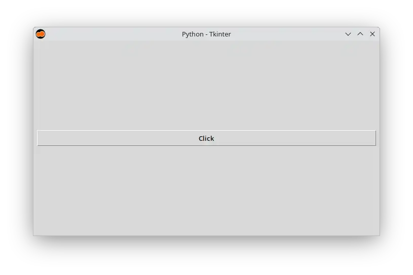

Code:

- [Python](src/button/main.py).

---

### Canvas

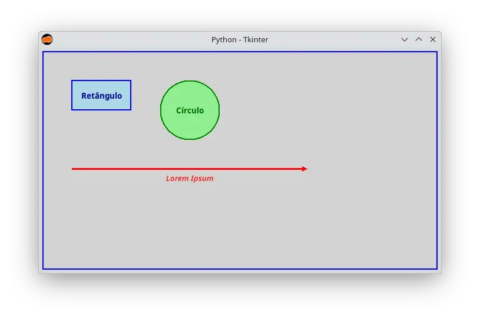

Code:

- [Python](src/canvas/main.py).

---

### Checkbutton

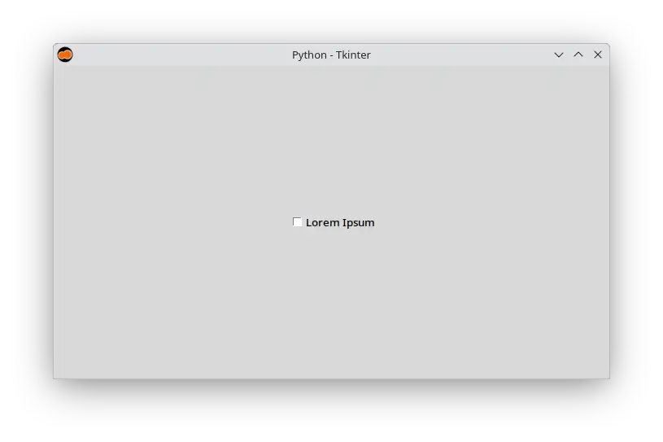

Code:

- [Python](src/check-button/main.py).

---

### DND

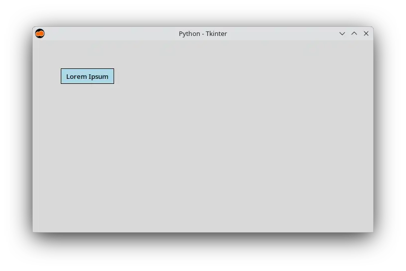

Code:

- [Python](src/dnd/main.py).

---

### Entry

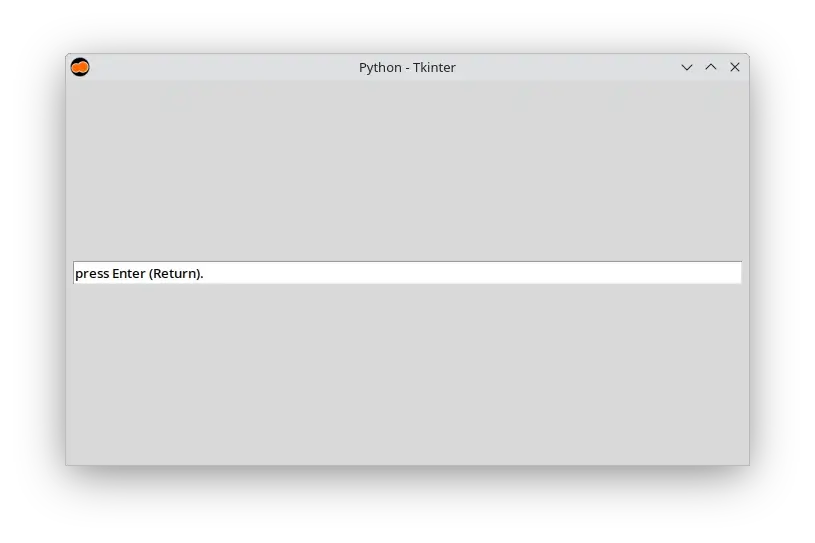

Code:

- [Python](src/entry/main.py).

---

### Label

Code:

- [Python](src/label/main.py).

---

### Listbox

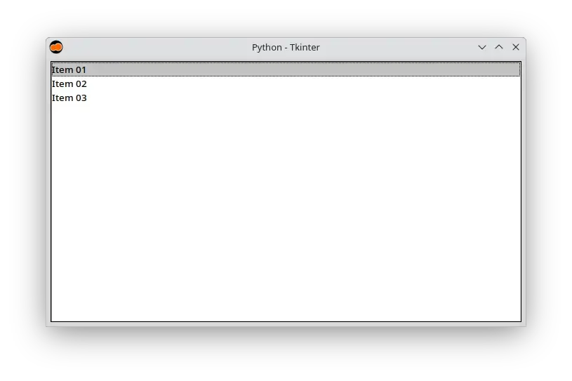

Code:

- [Python](src/listbox/main.py).

---

### MainWindow

Code:

- [Python](src/main-window/main.py).

---

### Menu

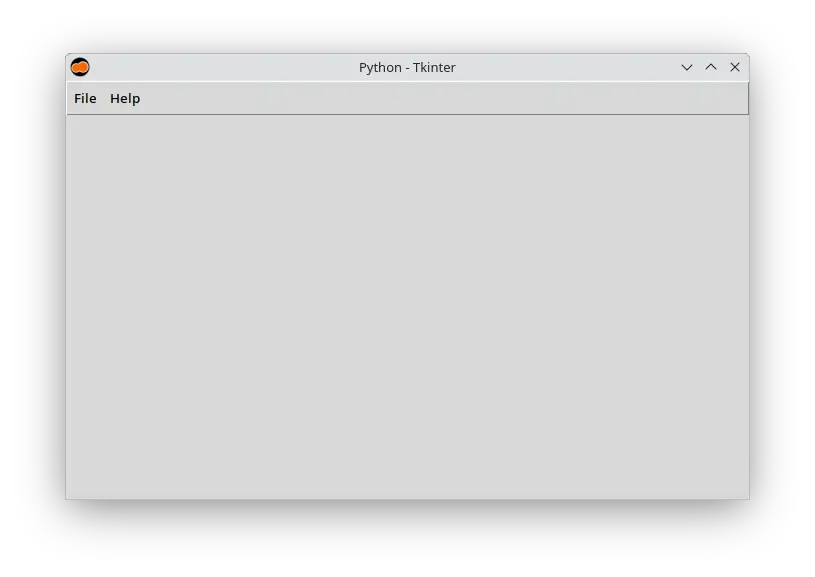

Code:

- [Python](src/menu/main.py).

---

### Menubutton

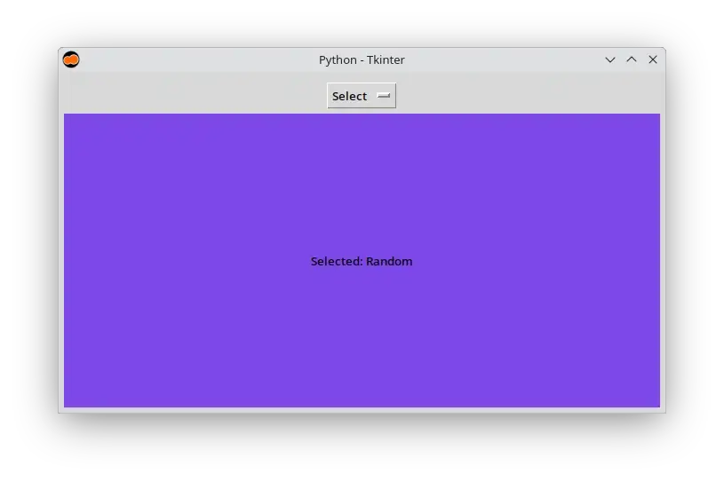

Code:

- [Python](src/menu-button/main.py).

### Notebook

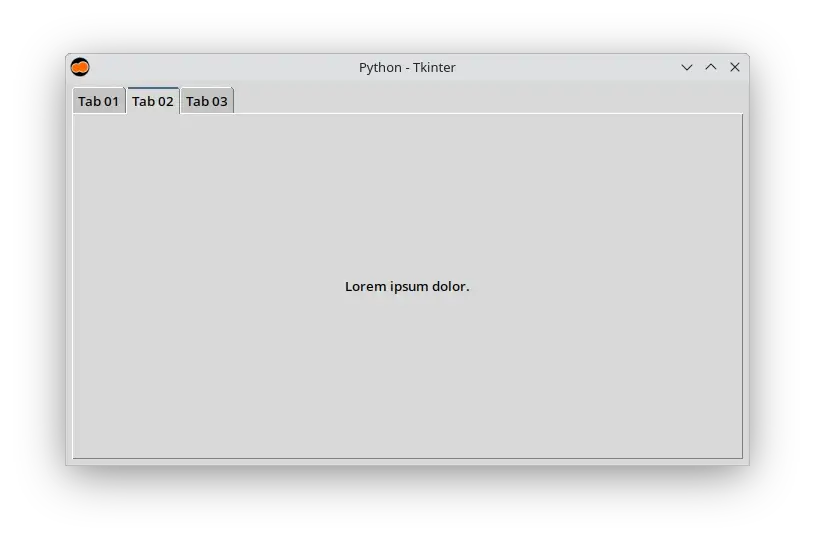

Code:

- [Python](src/notebook/main.py).

---

### Progressbar

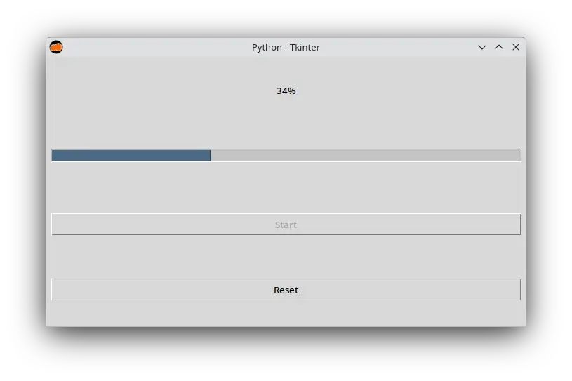

Code:

- [Python](src/progressbar/main.py).

---

### Radiobutton

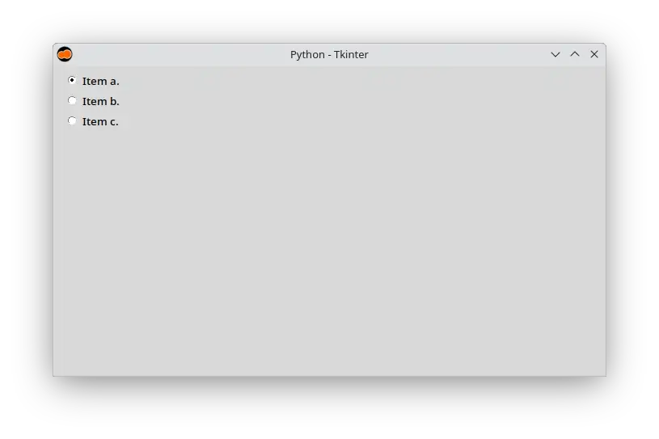

Code:

- [Python](src/radio-button/main.py).

---

### Scale

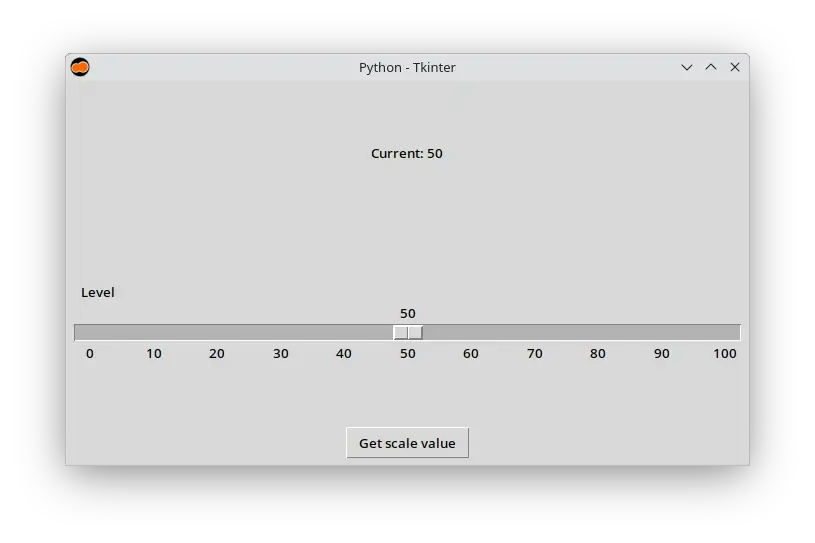

Code:

- [Python](src/scale/main.py).

---

### Scrollbar

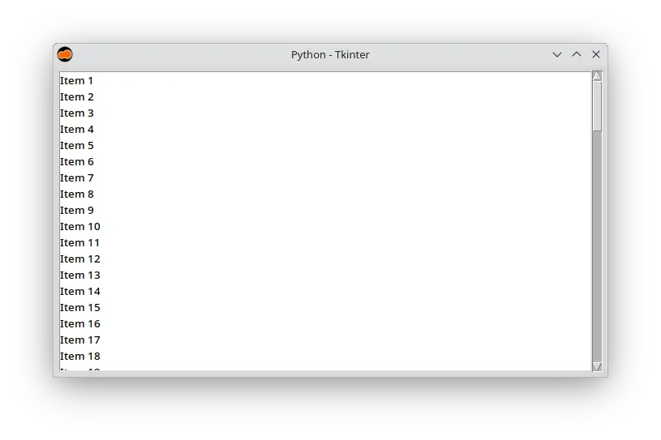

Code:

- [Python](src/scrollbar/main.py).

---

### Separator

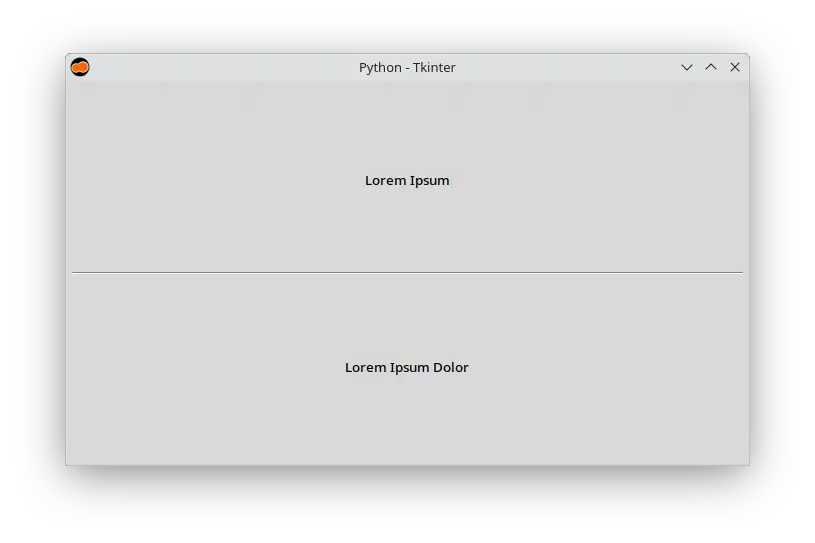

Code:

- [Python](src/separator/main.py).

---

### Sizegrip

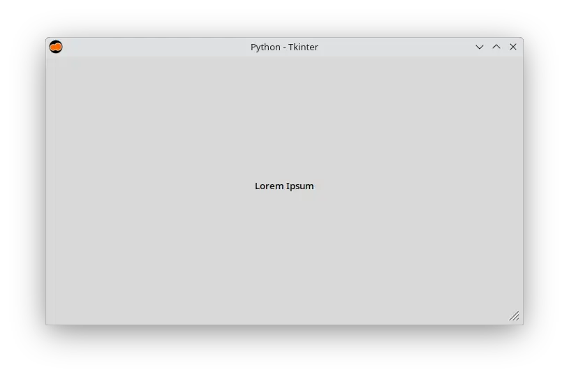

Code:

- [Python](src/sizegrip/main.py).

---

### Spinbox

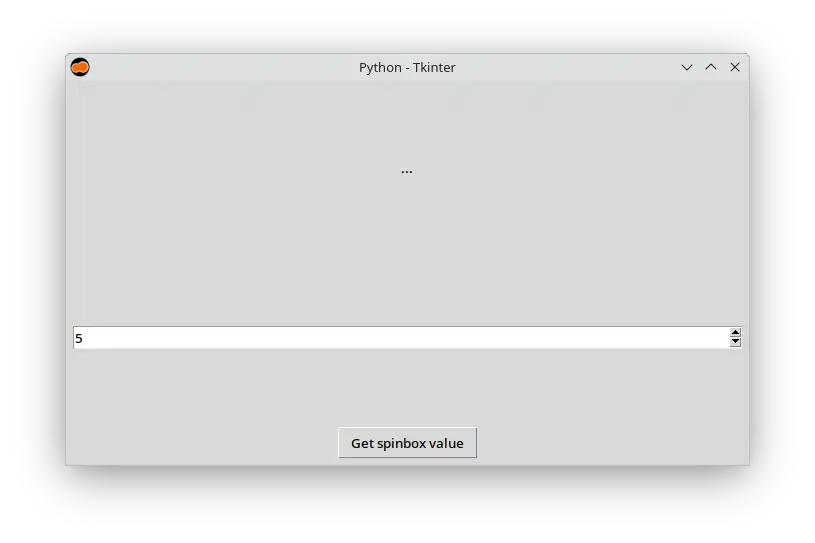

Code:

- [Python](src/spinbox/main.py).

---

### Text

Code:

- [Python](src/text/main.py).

---

### Treeview

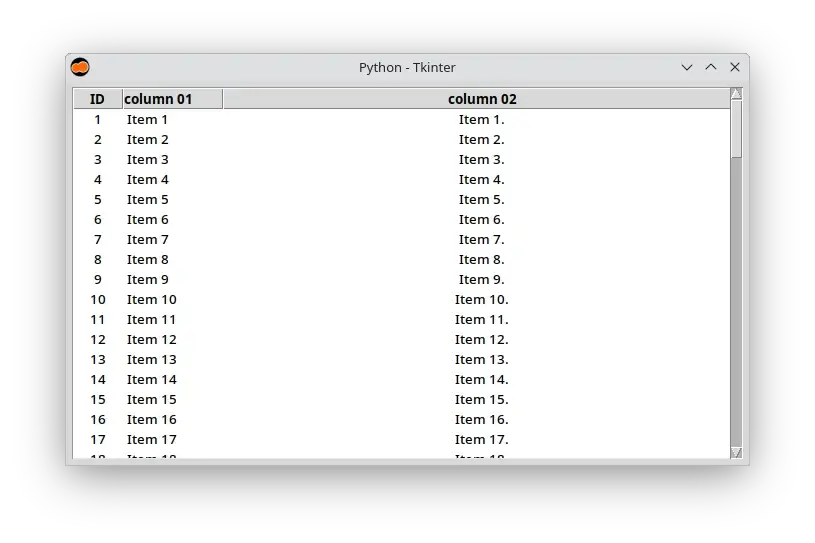

Code:

- [Python](src/treeview/main.py).

---
